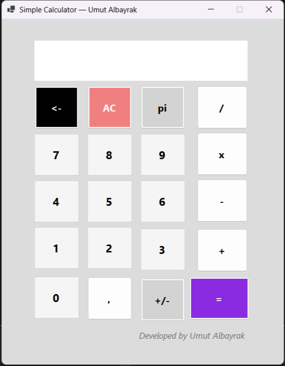

# 🧮 Simple Calculator App

A simple calculator built with **C# (WinForms)** that supports basic arithmetic operations.

---

## ✨ Features
- ➕ Addition  
- ➖ Subtraction  
- ✖ Multiplication  
- ➗ Division (with zero check)  
- ± Negate values  
- , Decimal support  
- ← Backspace  
- π Constant button  
- AC Clear all  

---

## 🖼️ Preview

---

## 🛠️ Technologies
- C# / .NET 8
- Windows Forms
- Visual Studio 2026

---

## 📦 Download
➡ [Download Simple Calculator v1.0](https://github.com/Umutalb/SimpleCalculatorApp/releases/tag/v1.0.1)

---

## 👨‍💻 Developed by
**Umut Albayrak**  
[GitHub Profile](https://github.com/Umutalb)
